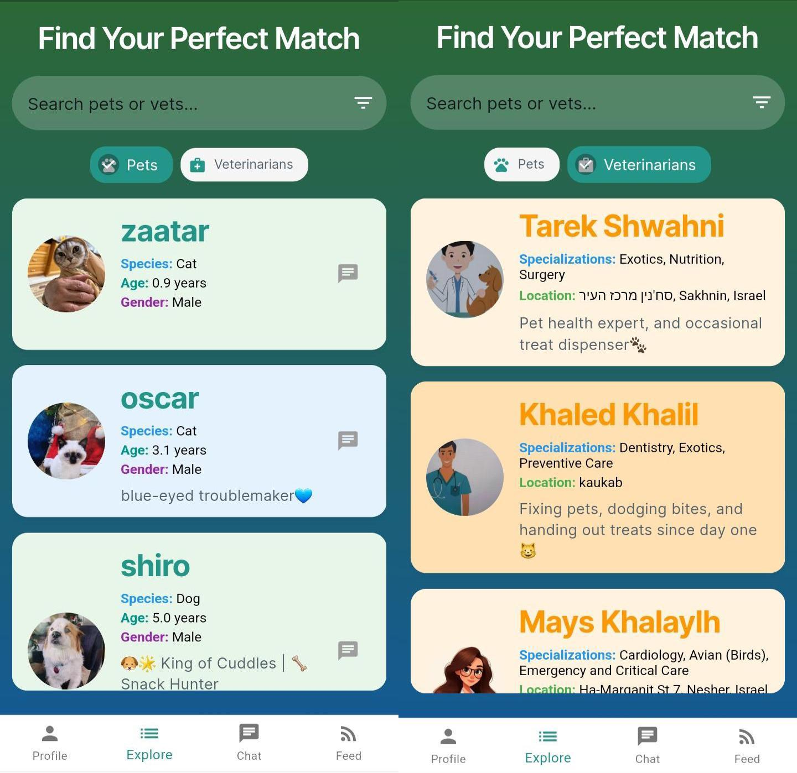

# 🐾 PetCare

**PetCare** is a comprehensive Android app designed to help pet owners manage their pets' health and well-being. 
With features ranging from medical history tracking to real-time reminders and vet integration, PetCare offers a complete digital assistant for responsible pet care.

---

## 📱 Features

- ✅ **User Authentication**
  - Secure Google Sign-In integration

- 🐶 **Pet Profile Management**
  - Add pets with details like breed, age, gender, and photo
  - Track allergies, medications, and special notes
  - Set status updates (e.g., "Open to walk", "Open to breeding")

- 🗂️ **Health & Medical Records**
  - Maintain medical history for each pet
  - Record allergies, vaccinations, and chronic conditions
  - Add vet visit notes

- 🗓️ **Reminders**
  - Schedule reminders for vaccinations, vet appointments, and medications

- 👩‍⚕️ **Vet Profiles**
  - Store and view vet details
  - See which pets are treated by which vets

- ❤️ **Favorites List**
  - Bookmark preferred vets or services

- 📰 **Pet Feed**  
  Browse pet care content, updates, and community news in a central feed.

- 💬 **Chatbot Assistant**
  - AI-powered chatbot to answer questions and assist with pet care tasks

- ☁️ **Cloud Storage**  
  - All pet data is synced using **Firebase Firestore** and media files are stored in **Firebase Storage**.

---

## 🛠️ Built With

- 📱 Android (Kotlin/Java)  
- 🔥 Firebase  
  - Authentication (Google Sign-In)  
  - Firestore (for users, pets, and vets data)  
  - Storage (for pet images and documents)  
- 🎨 Material Design for modern UI/UX  
- 🤖 AI-powered chatbot powered by **Google Gemini API**

---

## 🚀 Getting Started

1. **Clone the repo**

   ```bash
   git clone https://github.com/TarekZSh/PetCare-Android.git
   cd PetCare-Android
   ```
2. **Open the project** in Android Studio or your preferred Flutter IDE.

3. **Set up Firebase:**
   - Go to [Firebase Console](https://console.firebase.google.com/u/2/project/petcare-31013/overview)
   - Create a new Firebase project.
   - Add your Android app with the correct package name.
   - Download `google-services.json` and place it in `android/app/`.

4. **Enable services in Firebase:**
   - 🔐 Authentication → Enable **Google Sign-In**
   - 🔥 Firestore Database → Create collections: `Users`, `Pets`, `Vets`
   - ☁️ Firebase Storage → Enable for media and documents

5. **Run the app:**

   ```bash
   flutter pub get
   flutter run
   ```
---

## 🧱 Firebase Structure Overview
<details>
<summary>📂 Click to view Firebase Structure</summary>

### 🧑‍💼 Users Collection
```json
{
  "id": "string",                  // Firebase Auth UID
  "name": "string",
  "birthDay": "string (YYYY-MM-DD)",
  "phoneNumber": "string",
  "imageUrl": "string or null",
  "bio": "string",
  "petIds": ["string"]             // List of pet document IDs
}
```
### 🐾 Pets Collection
```json
{
  "id": "string",                         // Unique pet ID
  "name": "string",
  "species": "string",
  "breed": "string",
  "gender": "string",
  "age": number,
  "birthDate": "string (ISO format)",
  "weight": number,
  "height": number,
  "bio": "string",
  "imageUrl": "string or null",
  "owner": "string",                     // Owner's name
  "ownerId": "string",                   // Firebase UID of the owner
  "specialNotes": ["string"],
  "medicalHistory": ["string"],
  "vaccinations": ["string"],
  "events": ["string"],
  "vetEvents": ["string"],
  "lastActivities": ["string"],
  "documents": ["string"],
  "preferences": {
    // key-value map (custom user-defined fields)
  }
}
```
### 🩺 Vets Collection

```json
{
  "id": "string",                          // Firebase Auth UID
  "name": "string",
  "email": "string",
  "phone": "string",
  "location": "string",
  "bio": "string",
  "profileImageUrl": "string",
  "degree": "string",
  "university": "string",
  "yearsOfExperience": number,
  "specializations": ["string"],          // List of specialties
  "patientPetIds": ["string"]             // List of pet IDs under this vet's care
}
```
</details>

---

## 📸 Screenshots
<details>
<summary>👀 Click to see the screenshots</summary>
  
### 🐾 Pet Profile  
Manage each pet's medical history, status, and personal info.  


### 👩‍⚕️ Vet Profile  
View vet details, availability, and connect easily.  


### 👤 User Profile  
Edit your personal info and manage all your pets from one place.  


### 💬 Chatbot Assistant  
Get quick answers and guidance using the built-in AI chatbot.  


### 📰 Pet Feed  
Stay updated with pet care tips and the latest pet-related news.  


### 🔍 Explore Other Pets & Vets  
Discover potential breeding matches and nearby veterinary services.  

</details>

---

## ✨ Contributing

Pull requests are welcome! If you’d like to help improve PetCare, feel free to fork the repo and submit a PR.

---

## 📄 License

This project is licensed under the MIT License. See the [LICENSE](pet_care_app/LICENSE) file for more info.

---

## 🙋‍♂️ Contact

Developed by Tarek Shawahni, Mays Khalaily, and Khalid Khalil.  
For questions or suggestions, feel free to open an issue.


